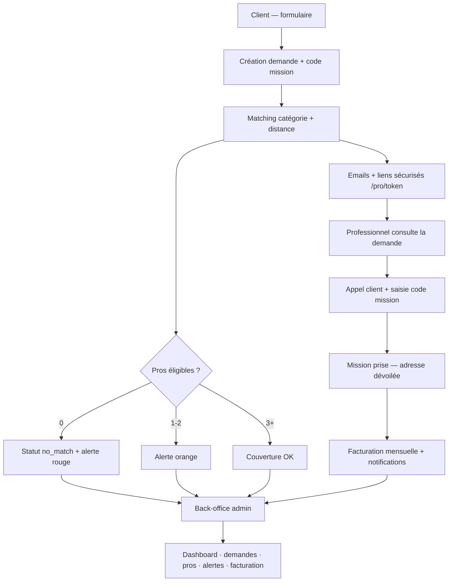

# Need's It

Plateforme de mise en relation entre **particuliers** et **professionnels** du dépannage et des services à domicile.

Un particulier décrit son besoin en ligne ; la plateforme identifie les professionnels éligibles, leur envoie un lien sécurisé, et coordonne la prise en charge de la mission via un code de validation. Un back-office permet de piloter l'activité, la couverture géographique et la facturation.

---

## 🎯 Le projet

**Problème :** mettre en relation rapidement une demande de dépannage ou de service à domicile avec des professionnels disponibles, sans imposer de compte ni de friction inutile aux deux parties.

**Solution :** un parcours client simple (formulaire + code mission), un accès professionnel par lien sécurisé (sans compte), et un matching automatique basé sur la catégorie de métier et la distance d'intervention. L'adresse du client n'est dévoilée qu'après validation téléphonique via le code mission.

**Périmètre V1 :** pas de compte client, pas de compte professionnel permanent, pas de paiement en ligne — la plateforme se concentre sur la mise en relation, le suivi des missions et la facturation manuelle côté admin.

---

## 👨‍💻 Mon rôle

**Fondateur & concepteur technique** — j'ai conçu et piloté l'ensemble de la solution, avec une implémentation assistée par des outils d'IA.

Concrètement :

- **Conception produit** — analyse du besoin, définition des fonctionnalités, parcours utilisateurs (client, professionnel, administrateur)
- **Conception technique** — architecture applicative, modélisation des données, flux métier (matching, prise de mission, alertes, facturation)
- **Intégration des services** — Supabase, Resend, API BAN, Telegram
- **Gestion du projet** — avancement par étapes, cohérence fonctionnelle, documentation
- **Développement assisté par IA** — implémentation, compréhension et validation du fonctionnement technique

---

## ⚙️ Fonctionnement

**Parcours principal :**

1. Le client remplit le formulaire sur la page d'accueil (catégorie, description, photos, adresse).
2. Une demande est créée avec un **code mission** unique (4 caractères).
3. Le **matching** identifie les professionnels éligibles (catégorie + distance ≤ rayon d'intervention).
4. Chaque pro reçoit un **email** avec un **lien sécurisé** (`/pro/[token]`).
5. Le pro consulte la demande (nom et téléphone visibles, **adresse masquée**).
6. Le pro appelle le client ; le client communique le code mission par téléphone.
7. Le pro saisit le code → la mission est prise → l'adresse est dévoilée.
8. Les autres professionnels sont notifiés que la mission est attribuée.
9. L'administrateur pilote l'ensemble via le back-office (`/admin`).

**Cas particuliers :**

- Aucun pro trouvé → statut `no_match` + alerte rouge
- 1 ou 2 pros → alerte orange
- Mission libérée par un pro → demande remise en attente, emails de réactivation
- Rappel automatique à 30 min si la demande reste en attente (cron)

---

## 🏗️ Architecture

Application **Next.js 15** (App Router) avec **server actions** pour les mutations métier. La couche données repose sur **Supabase** (PostgreSQL, Auth, Storage). Les emails passent par **Resend** ; les alertes couverture peuvent être relayées via **Telegram**. Le géocodage utilise l'**API BAN** (adresse.data.gouv.fr).

Organisation détaillée du projet et responsabilités des différentes couches : voir [`docs/ARCHITECTURE.md`](docs/ARCHITECTURE.md).

---

## ✨ Fonctionnalités principales

### Côté client

- Formulaire de demande (catégorie, description, photos, adresse avec autocomplete BAN)
- Code mission affiché après envoi
- Pages légales (politique de confidentialité, CGU, mentions légales)
- Interface responsive, thème clair/sombre

### Côté professionnel

- Accès par **lien sécurisé** unique (sans compte)
- Consultation de la demande (adresse masquée avant validation)
- Prise de mission via code communiqué par téléphone
- Libération de mission + réactivation des autres pros
- Emails transactionnels (nouvelle demande, confirmation, rappel, etc.)

### Back-office administrateur

- **Dashboard** — stats du jour, activité récente, alertes importantes
- **Demandes** — liste, détail, historique d'événements
- **Professionnels** — création, modification, suspension, fiche (missions + paiements)
- **Candidats** — validation, refus, suspension
- **Alertes** — couverture rouge/orange, filtres, résolution
- **Opportunités** — grille couverture par catégorie, zones à développer
- **Facturation** — suivi mensuel manuel (envoyée / payée)
- **Paramètres** — prix mission, email expéditeur, Telegram, catégories
- **Authentification** — connexion Supabase Auth (email + mot de passe)

### Système de couverture & notifications

- Analyse automatique à chaque nouvelle demande (rouge / orange / vert selon le nombre de pros éligibles)
- Notifications dashboard, email admin et Telegram (si configuré)
- Alerte « Aucune réponse » après 30 min via cron

---

## 🛠️ Stack technique

Technologies utilisées dans le projet:

| Couche | Technologie |
|--------|-------------|
| Frontend | Next.js 15 (App Router), React 19, TypeScript, Tailwind CSS 4 |
| Backend / BDD | Supabase (PostgreSQL, Auth, Storage) |
| Emails | Resend |
| Notifications | Telegram (alertes couverture, si configuré) |
| Géocodage | API BAN (adresse.data.gouv.fr) |

---

## 🔐 Sécurité & données

- **Liens sécurisés pro** — token unique par couple demande/professionnel, pas de compte requis
- **Adresse masquée** — dévoilée uniquement après validation du code mission par téléphone
- **Authentification admin** — Supabase Auth + middleware sur `/admin/*` + vérification de session dans les server actions
- **Opérations serveur** — clé service role Supabase côté serveur uniquement, jamais exposée au client
- **Documents légaux** — politique de confidentialité, CGU, mentions légales (pages publiques) ; registre RGPD interne (`REGISTRE_RGPD.md`, non publié)
- **Données** — schéma PostgreSQL avec UUID, pas de suppression physique, statuts et historique d'événements (`request_events`)
- **Photos** — stockage Supabase Storage (max 5, compression côté client)

---

## 📱 UX / conception

- **Mobile-first** — parcours client et pro pensés pour le téléphone ; admin utilisable sur mobile, optimisé desktop
- **Design system** — tokens CSS (couleurs, rayons, ombres), composants UI réutilisables (`Button`, `Input`, `Table`, `AlertBanner`, etc.)
- **Identité visuelle** — palette Need's It (turquoise, crème, bleu foncé), logos clair/sombre, police Inter
- **Thème clair/sombre** — bascule disponible côté client
- **Accessibilité** — lien « Aller au contenu principal » (`SkipLink`), attributs ARIA sur les champs et listbox, messages d'erreur unifiés

---

## 🚧 État du projet

V1 fonctionnelle, avec les parcours client, professionnel et administrateur, le matching, les notifications, le suivi des missions et la facturation manuelle.

Les évolutions hors périmètre de la V1 et les limites détaillées sont documentées dans [`docs/ARCHITECTURE.md`](docs/ARCHITECTURE.md).

---

## 📚 Documentation technique

Pour le setup, le schéma de données, l'arborescence du code, les conventions de développement et le détail des étapes d'implémentation :

**→ [`docs/ARCHITECTURE.md`](docs/ARCHITECTURE.md)**

---

## 🧠 Ce que le projet démontre

- **Conception produit** — traduction d'un besoin métier en parcours utilisateurs concrets (3 acteurs, sans compte client ni pro)
- **Modélisation de flux** — matching géographique, validation par code, gestion des états de mission et des cas limites (aucun pro, libération, rappel)
- **Architecture applicative** — séparation pages / services / actions serveur, intégration de services externes (BDD, emails, géocodage, notifications)
- **Modélisation de données** — schéma relationnel avec statuts, historique d'événements, facturation mensuelle et alertes de couverture
- **Réflexion sécurité & RGPD** — masquage d'adresse, liens tokenisés, auth admin, documents légaux et registre de traitement
- **Pilotage de projet** — avancement structuré par étapes, documentation, identification des limites V1 et de la roadmap
